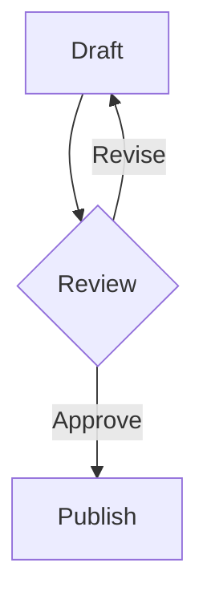
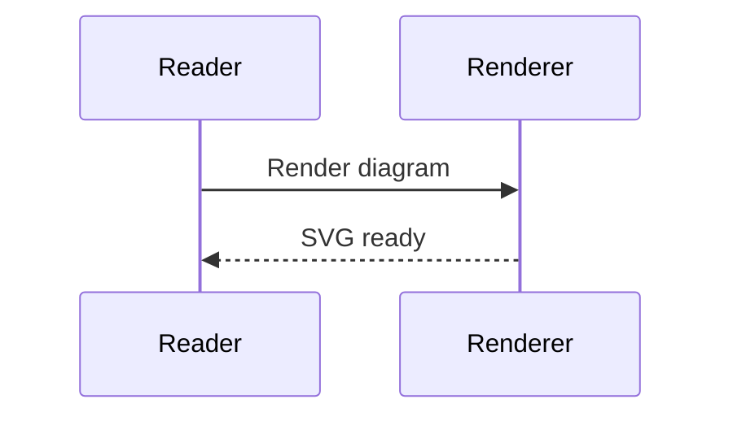
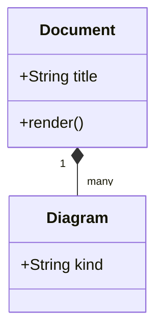
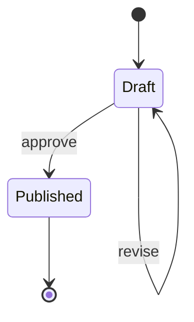
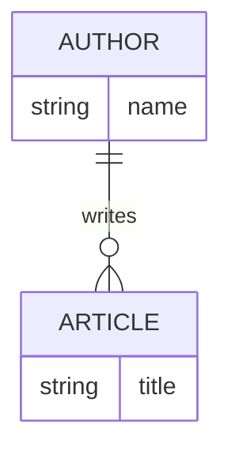
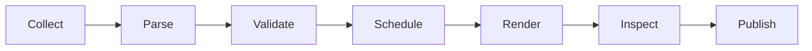

# Mermaid reading view

This fixture checks Mermaid diagrams in reading view. Each diagram has nearby prose so that layout overlap is easy to detect.

## Flowchart

The first diagram shows a short review loop.



Text after the flowchart must remain visible.

## Sequence diagram

The sequence uses two participants and two messages.



Text after the sequence diagram separates it from the next block.

## Class diagram

The class diagram shows one composition relationship.



The class diagram must keep its labels readable.

## State diagram

The state diagram has one branch and a terminal state.



Text after the state diagram must not overlap it.

## Entity relationship diagram

The entity relationship example uses a single relationship.



Text after the entity relationship diagram remains part of the document flow.

## Wide flowchart

This deliberately wide diagram must fit the reading column without horizontal scrolling.



The paragraph after the wide diagram must be visible at the normal reading width.

## Uppercase fence

The language tag is uppercase and must still select Mermaid.

```MERMAID
flowchart LR
    Uppercase[Uppercase tag] --> Accepted[Accepted]
```

The uppercase case must not become a code block.

## Mixed-case fence

The language tag uses mixed case and must still select Mermaid.

```MeRmAiD
sequenceDiagram
    Browser->>Worker: Mixed-case tag
    Worker-->>Browser: Accepted
```

The mixed-case case must render before the invalid example.

## Invalid Mermaid

The invalid diagram must show its source and one concise error line. It must not stop later content.

```mermaid
flowchart TD
    Broken[Missing bracket --> StillBroken
```

This prose after the invalid Mermaid block must remain visible.

## Non-Mermaid fence

The Rust fence must stay a normal code block.

```rust
fn main() {
    println!("not Mermaid");
}
```

End of the shared native and browser fixture.
